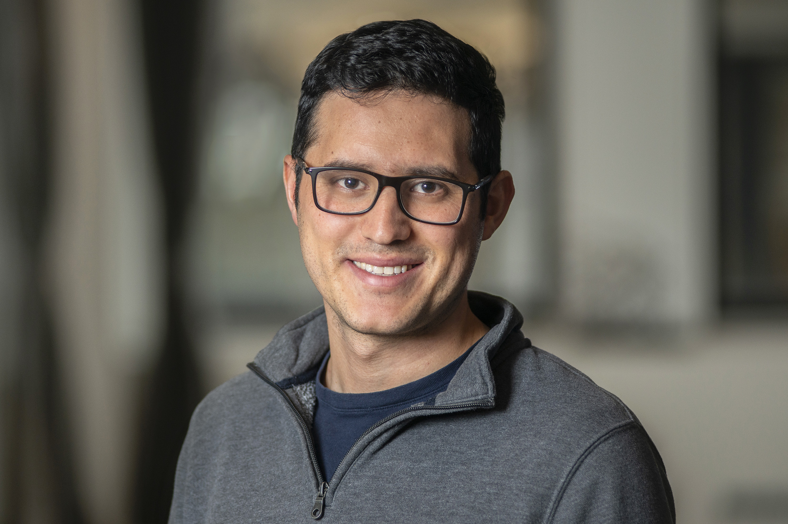

||  Hi! I’m a postdoctoral fellow at the [Center for Computational Astrophysics (CCA)
(https://www.simonsfoundation.org/flatiron/center-for-computational-astrophysics/) at the Flatiron Institute. I study the dynamics of the Milky Way and its satellite galaxies to understand how dark matter is distributed about the galaxy and its formation history.
